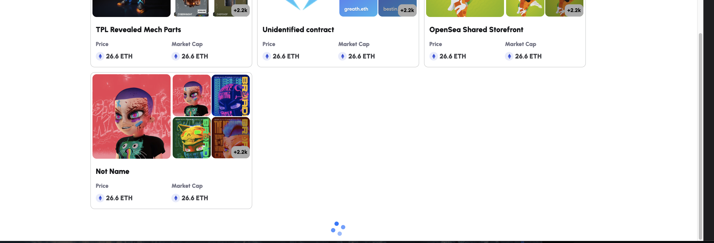

# 배포 URL
### https://granopam.netlify.app/

# 주요 기능

- ### 기능 1 : 브라우저가 메타마스크를 지원하는지 확인
  - #### 네이버 웨일
  - 
  - #### 구글 크롬
  - 

- ### 기능 2 : 메타마스크 플러그인으로 로그인.
  - 

- ### 기능 3 : 지갑 잔액과 지갑 주소 호출.
  - 

- ### 기능 4 : 탭 이동.
  - 

- ### 기능 5 : 무한 스크롤.
  - 

- ### 기능 6 : 링크 이동
  - 

- ### 기능 7: 반응형(Width 1400px ~~ 400px).
  - #### width 1400px
  - 
  - #### width 1000px
  - 
  - #### width 700px
  - 
  - #### width 400px
  - 


# 설치 및 실행 방법

## 프로젝트 설치
```shell
npm install

or

yarn install
```

## 프로젝트 실행
```shell
npm start

or

yarn start
```

# 사용 기술 및 도구

## Front

| 라이브러리               | 버전         |
|---------------------|------------|
| React               | ^18.2.0    |
| React Router DOM    | ^6.11.1    |
| Redux               | ^4.2.1     |
| React Redux         | ^8.0.5     |
| Ant Design          | ^5.4.7     |
| Styled Components   | ^6.0.0-rc.1|
| Emotion             | ^11.11.0   |
| Axios               | ^1.4.0     |

## Smart Contract And Blockchain

| 라이브러리                        | 버전         |
|----------------------------------|------------|
| Web3.js                          | ^1.10.0    |
| ethers.js                        | ^6.3.0     |
| web3-react                       | ^5.0.5     |
| @ethersproject/providers        | ^5.7.2     |
| @web3-react/injected-connector  | ^6.0.7     |

## 기타 유틸리티 및 도구

| 라이브러리                | 버전         |
|--------------------------|------------|
| Lodash                   | ^4.17.21   |
| Jazzicon                 | ^1.5.0     |
| TypeScript               | ^5.0.4     |
| ESLint                   | ^8.40.0    |
| Prettier                 | ^2.8.8     |


# 디렉토리 구조


```shell

├── public
│   ├── favicon.ico: 웹사이트의 파비콘 파일
│   ├── images: 이미지 파일들을 담고 있는 디렉토리
│       ├── bitMapImages: 비트맵 이미지 파일들을 담고 있는 디렉토리
│       │   ├── png: PNG 형식의 이미지 파일들을 담고 있는 디렉토리
│       │   │   ├── cheveron.png: 화살표 버튼 이미지 파일
│       │   │   ├── cheveron@2x.png: 화살표 버튼 이미지 파일 (2배 해상도)
│       │   │   ├── cheveron@3x.png: 화살표 버튼 이미지 파일 (3배 해상도)
│       │   │   ├── eth.png: 이더리움 이미지 파일
│       │   │   ├── eth@2x.png: 이더리움 이미지 파일 (2배 해상도)
│       │   │   ├── eth@3x.png: 이더리움 이미지 파일 (3배 해상도)
│       │   │   ├── logo-3.png: 로고 이미지 파일
│       │   │   ├── logo-3@2x.png: 로고 이미지 파일 (2배 해상도)
│       │   │   └── logo-3@3x.png: 로고 이미지 파일 (3배 해상도)
│       │   ├── svg: SVG 형식의 이미지 파일들을 담고 있는 디렉토리
│       │   │   └── logo-3.svg: 로고 이미지 파일 (SVG 형식)
│       │   └── webp: WebP 형식의 이미지 파일들을 담고 있는 디렉토리
│       │       ├── cheveron.webp: 화살표 버튼 이미지 파일
│       │       ├── cheveron@2x.webp: 화살표 버튼 이미지 파일 (2배 해상도)
│       │       ├── cheveron@3x.webp: 화살표 버튼 이미지 파일 (3배 해상도)
│       │       ├── eth.webp: 이더리움 이미지 파일
│       │       ├── eth@2x.webp: 이더리움 이미지 파일 (2배 해상도)
│       │       ├── eth@3x.webp: 이더리움 이미지 파일 (3배 해상도)
│       │       ├── logo-3.webp: 로고 이미지 파일
│       │       ├── logo-3@2x.webp: 로고 이미지 파일 (2배 해상도)
│       │       └── logo-3@3x.webp: 로고 이미지 파일 (3배 해상도)
│       └── profileIcon: 프로필 아이콘 이미지 파일들을 담고 있는 디렉토리
│           └── metamask-fox.svg: 메타마스크 폭스 아이콘 이미지 파일
├── src
│   ├── components: 재사용 가능한 컴포넌트들을 담고 있는 디렉토리
│   │   ├── buttons: 버튼 컴포넌트들을 담고 있는 디렉토리
│   │   │   ├── ConnectButtonForm.tsx: 연결 버튼 폼 컴포넌트
│   │   │   └── HeaderImageBtn.tsx: 헤더 이미지 버튼 컴포넌트
│   │   ├── cards: 카드 컴포넌트들을 담고 있는 디렉토리
│   │   │   ├── CardForm.tsx: 카드 폼 컴포넌트
│   │   │   ├── ContentCardListItem.tsx: 컨텐츠 카드 리스트 아이템 컴포넌트
│   │   │   ├── PriceSection.tsx: 가격 섹션 컴포넌트
│   │   │   └── SmailCard.tsx: 작은 카드 컴포넌트
│   │   ├── images: 이미지 관련 컴포넌트들을 담고 있는 디렉토리
│   │   │   ├── HeaderProfileImage.tsx: 헤더 프로필 이미지 컴포넌트
│   │   │   └── ProfileImage.tsx: 프로필 이미지 컴포넌트
│   │   ├── list: 목록 관련 컴포넌트들을 담고 있는 디렉토리
│   │   │   └── profileMenu: 프로필 메뉴 관련 컴포넌트들을 담고 있는 디렉토리
│   │   │       ├── ProfileMenuListIcon.tsx: 프로필 메뉴 리스트 아이콘 컴포넌트
│   │   │       └── ProfileMenuListItem.tsx: 프로필 메뉴 리스트 아이템 컴포넌트
│   │   └── texts: 텍스트 관련 컴포넌트들을 담고 있는 디렉토리
│   │   ├── HeaderTitleForm.tsx: 헤더 타이틀 폼 컴포넌트
│   │   └── ProfileMenuTitleForm.tsx: 프로필 메뉴 타이틀 폼 컴포넌트
│   ├── container: 컨테이너 컴포넌트들을 담고 있는 디렉토리
│   │   ├── contents: 컨텐츠 관련 컨테이너 컴포넌트들을 담고 있는 디렉토리
│   │   │   └── contentCardList.tsx: 컨텐츠 카드 리스트 컨테이너 컴포넌트
│   │   └── layout: 레이아웃 관련 컨테이너 컴포넌트들을 담고 있는 디렉토리
│   │       ├── PageContent.tsx: 페이지 컨텐츠 컨테이너 컴포넌트
│   │       ├── PageFooter.tsx: 페이지 푸터 컨테이너 컴포넌트
│   │       ├── PageHeader.tsx: 페이지 헤더 컨테이너 컴포넌트
│   │       ├── PageLayout.scss: 페이지 레이아웃의 SCSS 스타일 파일
│   │       ├── PageLayout.tsx: 페이지 레이아웃 컨테이너 컴포넌트
│   │       └── PageTabs.tsx: 페이지 탭 컨테이너 컴포넌트
│   ├── dataManager: 데이터 관리 관련 파일들을 담고 있는 디렉토리
│   │       ├── apiConfig.tsx: API 설정 파일
│   │       └── apiMapper.tsx: API 매핑 파일
│   ├── pages: 페이지 컴포넌트들을 담고 있는 디렉토리
│   │       └── home: 홈 페이지 관련 컴포넌트들을 담고 있는 디렉토리
│   │       └── Home.tsx.tsx: 홈 페이지 컴포넌트
│   ├── react-app-env.d.ts: Create React App의 환경 설정 파일
│   ├── reportWebVitals.ts: 웹 성능 측정 관련 파일
│   ├── setupTests.ts: 테스트 설정 파일
│   ├── styles: 스타일 관련 파일들을 담고 있는 디렉토리
│   │       └── reset.css: 초기화 스타일 파일
│   ├── store: 리덕스 함수
│   │   ├── store.tsx : Redux Store를 생성하고 관리하는 파일
│   │   └── redux : Redux 관련 파일들을 담고 있는 디렉토리
│   │       ├── cards : 카드 관련 컴포넌트와 상태를 담고 있는 디렉토리
│   │       │   └── AssetsSlice.tsx : 카드 관련 상태와 액션, 리듀서를 정의하는 파일
│   │       └── pages : 페이지 관련 컴포넌트와 상태를 담고 있는 디렉토리
│   │           └── CurrentPage.tsx : 현재 페이지 관련 상태와 액션, 리듀서를 정의하는 파일
│   ├── types: 타입 정의 파일들을 담고 있는 디렉토리
│   │       └── lodash: Lodash 라이브러리의 타입 정의 파일들을 담고 있는 디렉토리
│   │           └── index.d.ts: Lodash 타입 정의 파일
│   │           └── fonts.d.tsx: TypeScript에서 font파일 확장자를 인식하도록하는 설정 파일
│   └── utils: 유틸리티 함수들을 담고 있는 디렉토리
│       ├── UseAuth.tsx: Web3 MetaMask 인증 관련 커스텀 훅 파일
│       └── utility.tsx: 유틸리티 함수 파일
└── tsconfig.json: TypeScript 설정 파일
```